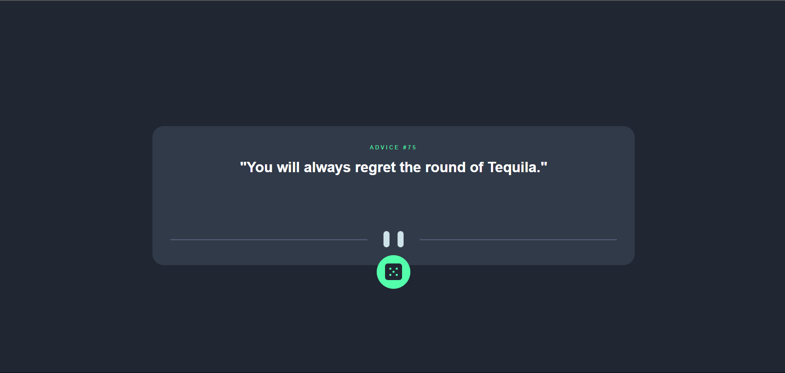

# Frontend Mentor - Advice generator app solution

This is a solution to the [Advice generator app challenge on Frontend Mentor](https://www.frontendmentor.io/challenges/advice-generator-app-QdUG-13db). Frontend Mentor challenges help you improve your coding skills by building realistic projects.

## Table of contents

- [Overview](#overview)
  - [The challenge](#the-challenge)
  - [Screenshot](#screenshot)
  - [Links](#links)
- [My process](#my-process)
  - [Built with](#built-with)
  - [What I learned](#what-i-learned)
  - [Continued development](#continued-development)
  - [Useful resources](#useful-resources)
- [Author](#author)
- [Acknowledgments](#acknowledgments)

**Note: Delete this note and update the table of contents based on what sections you keep.**

## Overview

### The challenge

Users should be able to:

- View the optimal layout for the app depending on their device's screen size
- See hover states for all interactive elements on the page
- Generate a new piece of advice by clicking the dice icon

### Screenshot



Add a screenshot of your solution. The easiest way to do this is to use Firefox to view your project, right-click the page and select "Take a Screenshot". You can choose either a full-height screenshot or a cropped one based on how long the page is. If it's very long, it might be best to crop it.

Alternatively, you can use a tool like [FireShot](https://getfireshot.com/) to take the screenshot. FireShot has a free option, so you don't need to purchase it.

Then crop/optimize/edit your image however you like, add it to your project, and update the file path in the image above.

**Note: Delete this note and the paragraphs above when you add your screenshot. If you prefer not to add a screenshot, feel free to remove this entire section.**

### Links

- Solution URL: [Add solution URL here](https://your-solution-url.com)
- Live Site URL: [AdVice generator](https://advice-generator-two-pi.vercel.app/)

## My process

### Built with

### Built with

- [React](https://reactjs.org/) - JS library
- [Styled Components](https://styled-components.com/) - For styles

### What I learned

This was the first time I made use of an Api with react, I also made use of the useEffect Hook for the first time to call the Api when the page loads up. This bit was a bit tasking and there's still a bug which I covered by added a loader and a timeout function.

```js
const [result, setResult] = useState({});
const [fetchState, setFetchState] = useState("");

// async function

useEffect(() => {
  fetchAdvice();
}, []);

const fetchAdvice = async () => {
  const res = await fetch("https://api.adviceslip.com/advice");

  setFetchState("isLoading");

  if (!res.ok) {
    console.error("failed to fetch advice:", res.status);
    return;
  }

  const data = await res.json();
  setResult(data.slip);
  setTimeout(() => {
    setFetchState("isOkay");
  }, 2000);
};
```

### Continued development

I plan to tackle another project that makes use of an Api, so I can fully grasps how to use make proper use of Apis and all the methods involved


## Author

- Website - [Louis](https://louis-macjob.vercel.app/)
- Frontend Mentor - [@that-loui](https://www.frontendmentor.io/profile/that-loui)
- Twitter - [@LMacjob](https://www.twitter.com/LMacjob)

